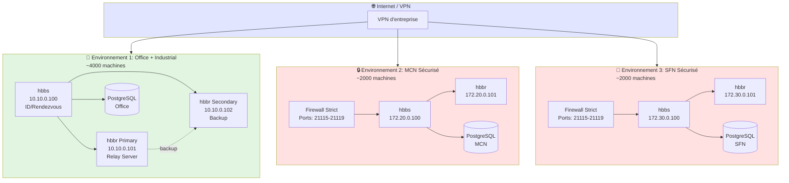
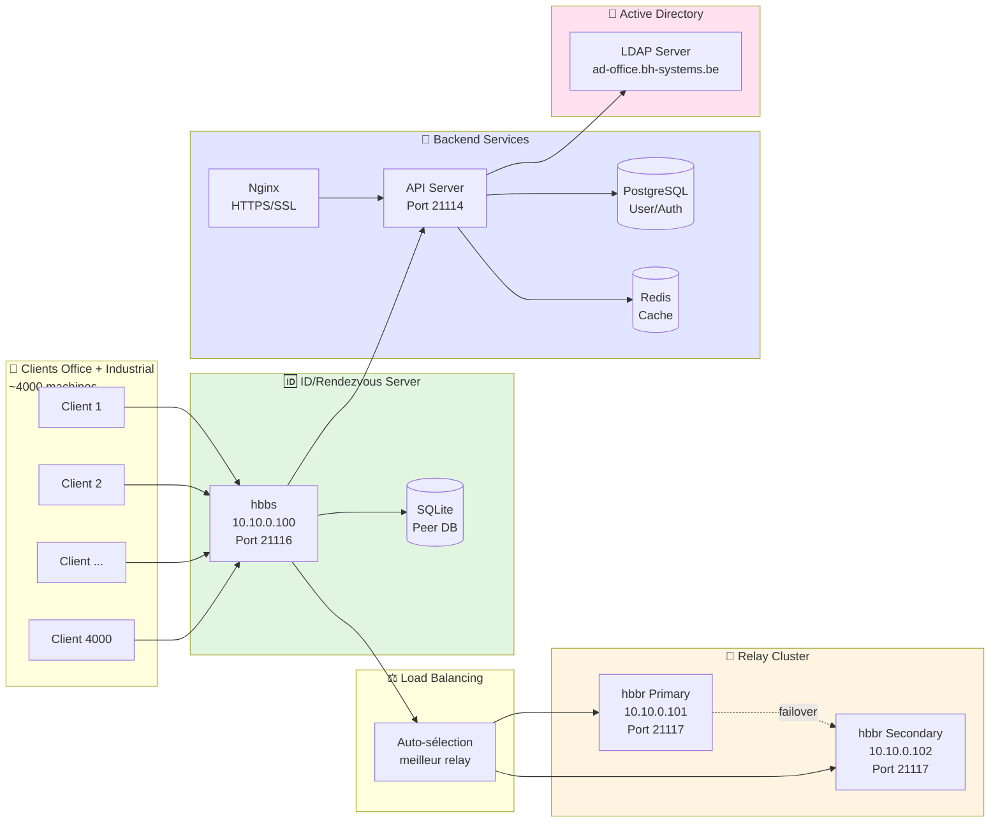
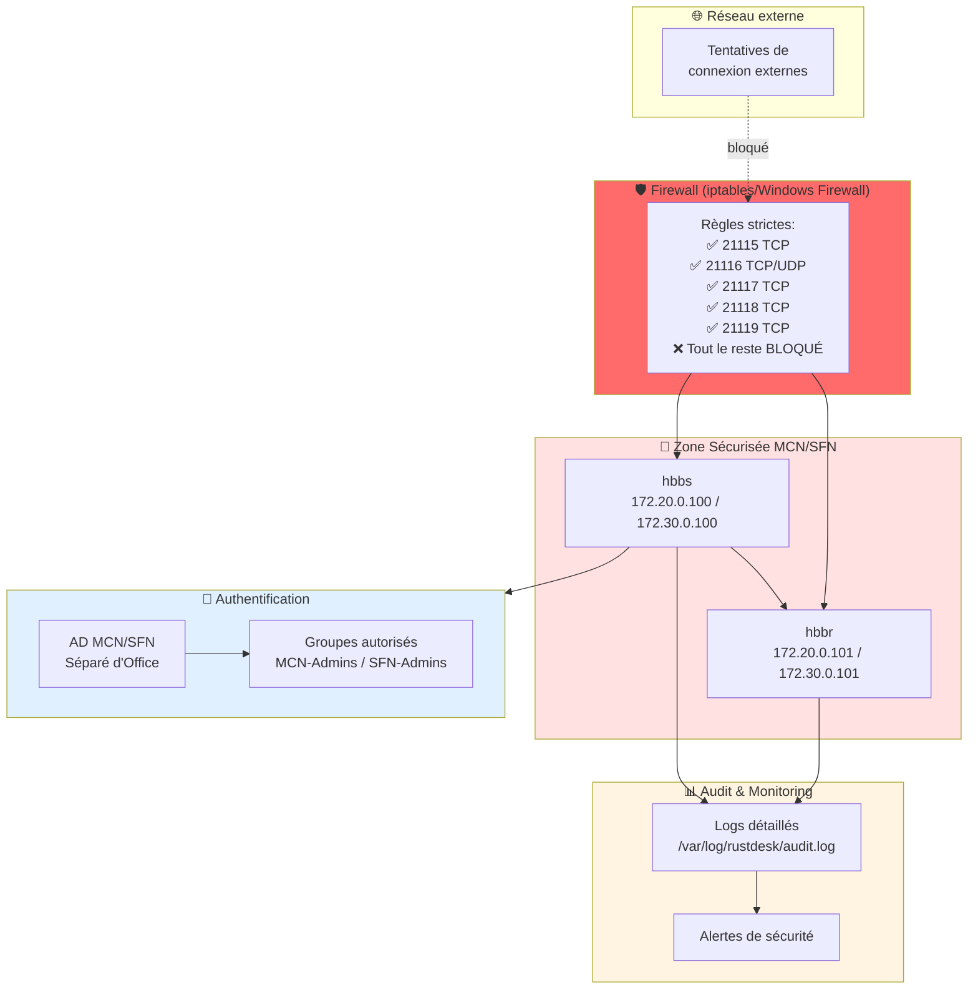
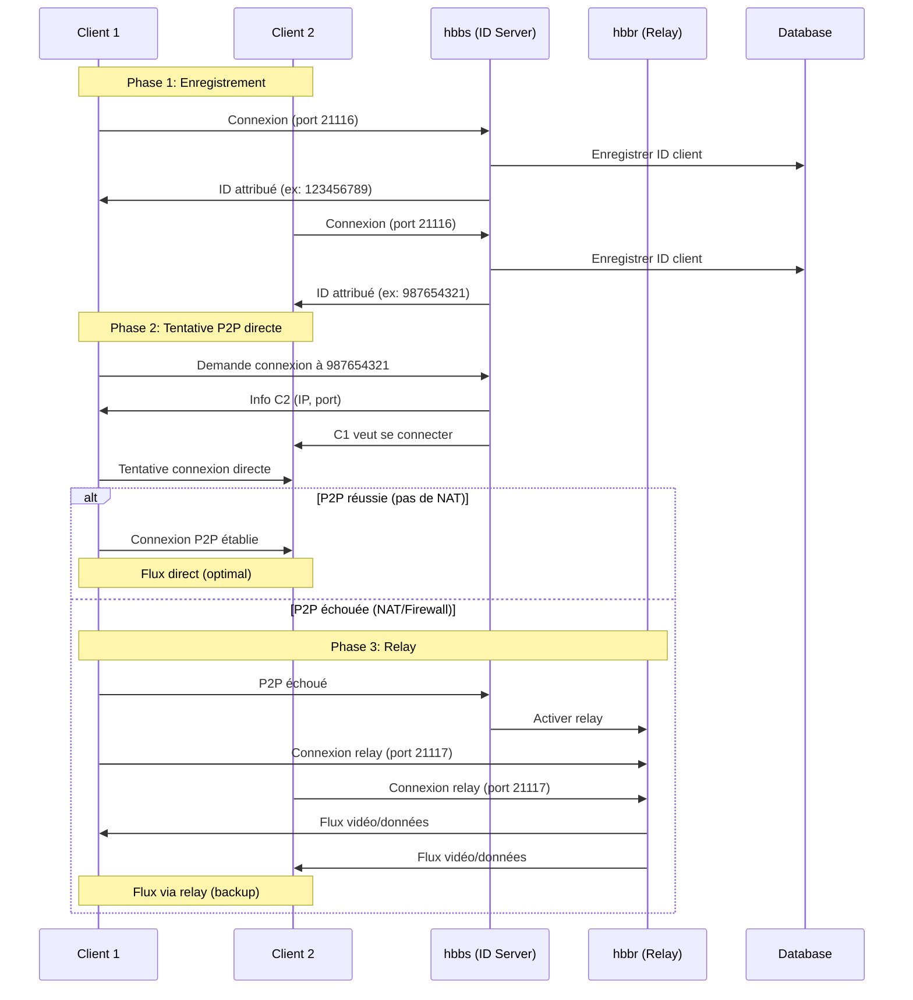
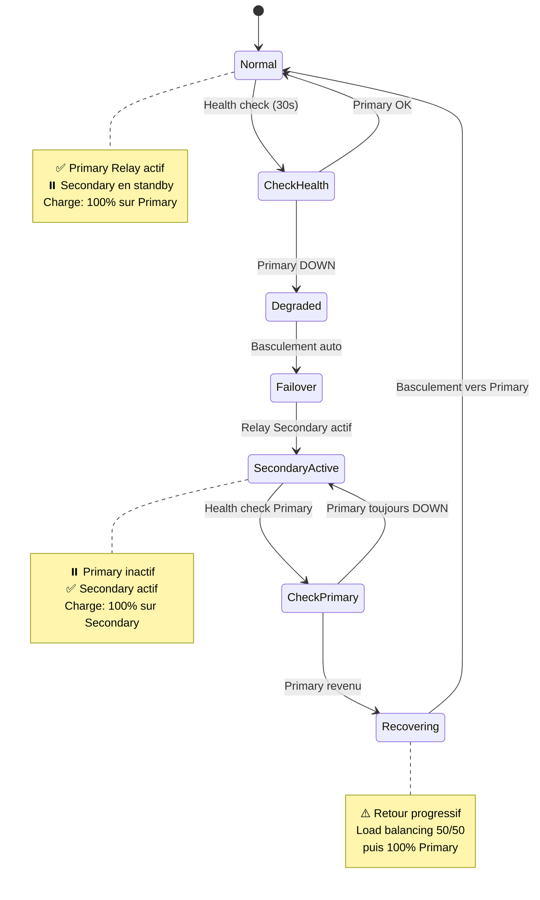
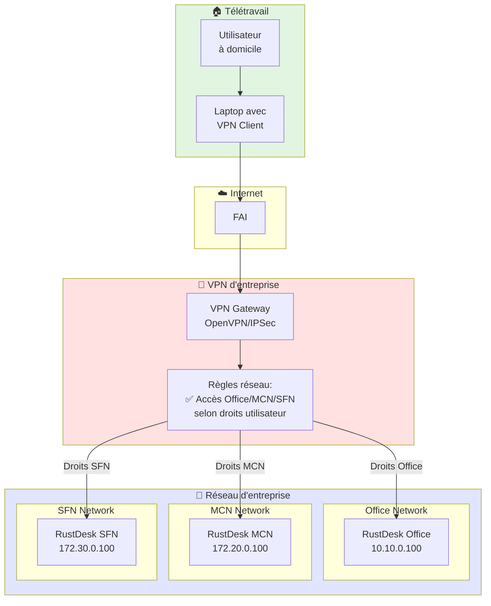
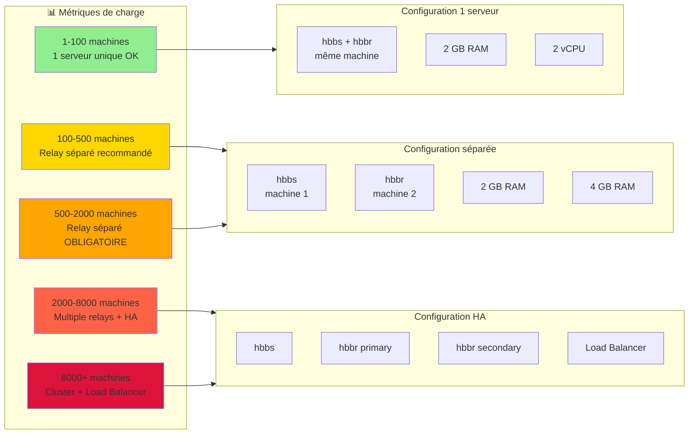
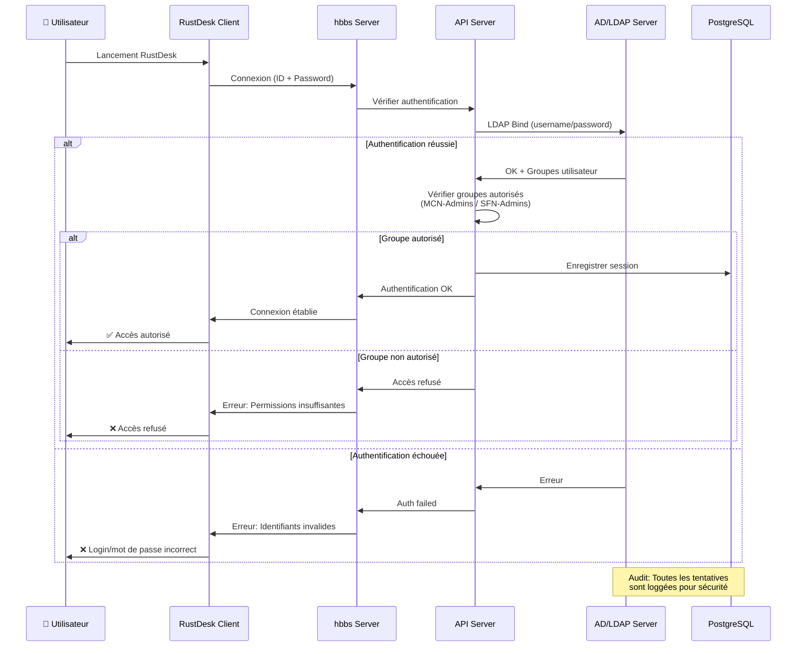

# Diagrammes d'Architecture RustDesk

Ce document contient les schémas d'architecture pour le déploiement RustDesk multi-environnements.

## 📊 Vue d'ensemble des 3 environnements



## 🏗️ Architecture détaillée - Environnement Office



## 🔒 Architecture Sécurisée - MCN/SFN



## 📡 Flux de connexion RustDesk



## 🔄 Haute Disponibilité - Failover Relay



## 🌐 Déploiement HomeworkingVPN



## 📦 Architecture Docker - Production

```mermaid
graph TB
    subgraph DockerHost["🐳 Docker Host"]
        subgraph Network["rustdesk-network (172.21.0.0/24)"]
            
            subgraph Container1["📦 Container: hbbs"]
                HBBS_PROC[Process: hbbs<br/>-r relay:21117]
                HBBS_VOL[/root/data<br/>SQLite DB + Keys]
            end
            
            subgraph Container2["📦 Container: hbbr"]
                RELAY_PROC[Process: hbbr<br/>-k _]
                RELAY_VOL[/root/data<br/>Shared Keys]
            end
            
            subgraph Container3["📦 Container: nginx"]
                NGINX_PROC[Nginx]
                SSL_CERTS[/etc/nginx/certs<br/>SSL Certificates]
            end
            
            subgraph Container4["📦 Container: postgres"]
                PG_PROC[PostgreSQL 15]
                PG_DATA[/var/lib/postgresql/data]
            end
            
            subgraph Container5["📦 Container: api"]
                API_PROC[API Server]
                API_DATA[/data]
            end
            
        end
    end
    
    subgraph HostPorts["🔌 Ports exposés"]
        P21115[21115:21115 TCP]
        P21116[21116:21116 TCP/UDP]
        P21117[21117:21117 TCP]
        P443[443:443 HTTPS]
    end
    
    HBBS_PROC --> RELAY_PROC
    NGINX_PROC --> API_PROC
    API_PROC --> PG_PROC
    
    Container1 --> P21115
    Container1 --> P21116
    Container2 --> P21117
    Container3 --> P443
    
    style Container1 fill:#e1f5e1
    style Container2 fill:#fff4e1
    style Container3 fill:#e1e5ff
    style Container4 fill:#ffe1f0
    style Container5 fill:#f0e1ff
```

## 📊 Charge et Scaling



## 🔐 Sécurité - Flux d'authentification LDAP



---

## 📝 Utilisation des diagrammes

Ces diagrammes sont en **Mermaid** et s'affichent automatiquement sur GitHub, GitLab, et dans VS Code avec l'extension Mermaid.

### Modifier un diagramme

1. Éditez le code Mermaid entre les balises ` ```mermaid ` et ` ``` `
2. Prévisualisez dans VS Code (Ctrl+Shift+V)
3. Committez sur GitHub pour voir le rendu final

### Exporter en PNG/SVG

- **GitHub** : Cliquez sur le diagramme → bouton "Download SVG"
- **VS Code** : Extension "Mermaid Editor" → Export
- **En ligne** : https://mermaid.live

## 🔗 Références

- [Documentation Mermaid](https://mermaid.js.org/)
- [Mermaid Live Editor](https://mermaid.live)
- [GitHub Mermaid Support](https://github.blog/2022-02-14-include-diagrams-markdown-files-mermaid/)
